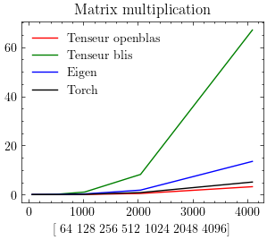

# tenseur-benchmarks
Benchmarks for tenseur  

## Build the benchmarks

Init the submodule and update it

```shell
git submodule init
```
Or updat it to the remote version

```shell
git submodule update --remote
```

Build the benchmarks:

```shell
mkdir build
cd build
cmake ../tenseur -DCMAKE_CXX_COMPILER=clang++
```

## Matrix multiplication



## Chained matrix multiplication


